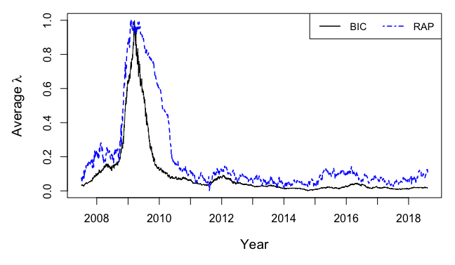

[](http://quantlet.de/)

## [](http://quantlet.de/) **TVRPfrm** [](http://quantlet.de/)

```yaml


Name of QuantLet: TVRPfrm

Published in : submitted to N/A

Description : 'Performs the Lasso regression with two distinct algorithms. The first one 
uses moving window method and the Bayesian information criterion (BIC) or the generalized 
cross-validation (GCV) to calibrate the penalty parameter (lambda), and the second is 
called the real-time adaptive penalization (RAP). The input data are daily logarithmic 
stock returns of 100 largest U.S. financial companies listed on NASDAQ. In the fitting 
procedure, each of the selected companies is taken as
a dependent variable and is regressed by means of the Lasso regression on the remaining 
ones. The code plots the time series of the average penalization parameter, lambda.'

Keywords : 'Lasso, shrinkage, L1-norm penalty, change point, bic, gcv, 
adaptive penalization, regression, plot, moving window, time-series, stock return'

See also : 'TVRPchangeSQR, TVRPchangeB, TVRPfmri, XFGTVP_BetaChange, XFGTVP_FRM, 
XFGTVP_LambdaSim, TVPactiveset, TVPbetanorm, TVPdesign, TVPvariance'

Author : Lenka Zboňáková

Submitted : 9 October 2018 by Lenka Zboňáková

Datafile : 100_firms_returns_and_scaled_macro_2018-08-13.csv

Input: 
- n.firm:      Number of companies (maximum is 100)
- w :          Size of the moving window
- w.rap :      Burn-in period for the RAP algorithm
- m.type:      Type of the method to calibrate lambda (“BIC” or “GCV”)
- r.factor:    Forgetting factor for the RAP
- s.size:      Step-size parameter for the RAP
- lambda.init: Initial lambda value for the RAP
```



### R Code
```r

# Clear all variables and close windows
rm(list = ls(all = TRUE))
graphics.off()

# Set working directory
# setwd("")

# Install and load packages
libraries = c("MASS", "scales", "foreach", "doParallel", "lars", "rRAP")
lapply(libraries, function(x) if (!(x %in% installed.packages())) {
  install.packages(x)} )
lapply(libraries, library, quietly = TRUE, character.only = TRUE)

source("TVRPfuncapp.r")

# Initiate cluster for parallel computing
n.cores = detectCores()   # Number of cores to be used
cl      = makeCluster(n.cores)
registerDoParallel(cl)
getDoParWorkers()

# Computation setup
n.firm      = 100    # Number of companies to include in computation (maximum is 200)
w           = 63     # Length of moving windows
w.rap       = 53     # Burn-in period for RAP algorithm
m.type      = "BIC"  # Method of choosing lambda (BIC or GCV - leads to overfit)
r.factor    = 0.95   # Forgetting factor for RAP
s.size      = 0.025  # Step-size parameter for RAP
lambda.init = 0.3    # Inital lambda value for RAP

# Load data: 100 companies
tmpdata = read.csv("100_firms_returns_and_scaled_macro_2018-08-13.csv",sep=",") # FRM data
data    = subset(tmpdata, select = c(2:(n.firm + 1)))
dates   = tmpdata[, 1]

# Define number of companies to regress in every core
n.appcores = rep((n.firm %/% n.cores), n.cores)
h.appcores = n.firm %% n.cores
if (h.appcores != 0){
  n.appcores[1:h.appcores] = n.appcores[1:h.appcores] + 1
}
n.parallel = sum(n.appcores != 0)

# LARS: Lasso estimation with moving windows of length w 
Sys.time()
out_tmp    = foreach(i = 1:n.parallel, .packages = c("lars")) %dopar% par.lassoapp(i)  
Sys.time()
out_lars   = res.app(n.parallel, out_tmp)      # Collect results from the cores

# RAP: Lasso estimation 
Sys.time()
out_tmp   = foreach(i = 1:n.parallel, .packages = c("lars", "rRAP")) %dopar% par.rapapp(i)   
Sys.time()
out_rap   = res.app(n.parallel, out_tmp)       # Collect results from the cores

# Close cluster
stopCluster(cl)

# Normalize values of lambda to [0, 1] interval
norm.lars = norm.0to1(out_lars$mean.lb.fit)
norm.rap  = norm.0to1(out_rap$mean.lb.fit[-seq(1:(w - w.rap))])

# Plot settings
par(mfrow = c(1, 1))
par(mar = c(5, 5, 1, 1))
at.tmp = c(grep("2008", dates)[1] - w, grep("2009", dates)[1] - w, 
           grep("2010", dates)[1] - w, grep("2011", dates)[1] - w, 
           grep("2012", dates)[1] - w, grep("2013", dates)[1] - w, 
           grep("2014", dates)[1] - w, grep("2015", dates)[1] - w, 
           grep("2016", dates)[1] - w, grep("2017", dates)[1] - w,
           grep("2018", dates)[1] - w)

# Plot time series of lambda both for LARS and RAP
plot(norm.lars, type = "l",  col = "black", axes = FALSE, 
     xlab = "Year", frame = TRUE, cex.main = 1.5, 
     ylab = expression(paste("Average ", lambda)), cex.lab = 1.2, lwd = 1)
axis(1, cex.axis = 1, labels = c(2008:2018), at = at.tmp)
axis(2, cex.axis = 1)
lines(norm.rap, col = "blue", lty = 2, lwd = 1.5)
legend("topright", c("BIC", "RAP"), col = c("black", "blue"),
       ncol = 2, cex = 0.9, lwd = 1.5, lty = c(1, 4, 2))


```

automatically created on 2018-10-30